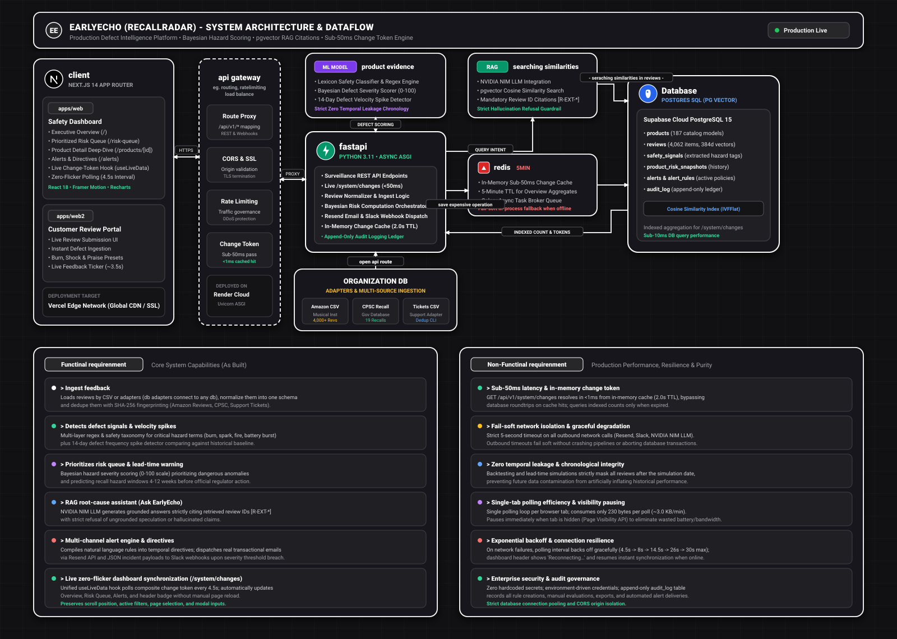

# EarlyEcho (RecallRadar)

> **Continuous Safety Intelligence & Early Recall Warning Platform**  
> *"Know a product is unsafe before the recall."*

EarlyEcho is an enterprise safety defect intelligence system that continuously monitors consumer reviews, regulatory reports, and customer warranty telemetry. It flags emerging safety hazards, computes Bayesian risk scores, dispatches multi-channel alerts, and predicts official product recalls weeks in advance.

---

## 🆚 Where EarlyEcho Fits

Review analytics tools tell you what customers are talking about. Recall management tools help you run a recall — after someone has already decided one is needed. **EarlyEcho sits in between**: it turns customer feedback into a cited, evidence-backed hazard score *before* a recall decision is made.

|  | **Review analytics**<br>(Thematic, Chattermill, Revuze) | **Recall management**<br>(Qualityze, TrackWise, IONI) | **EarlyEcho** |
|---|:---:|:---:|:---:|
| Reads customer feedback | ✅ | ❌ | ✅ |
| Safety-specific hazard score | ⚠️ mostly themes and sentiment | ⚠️ manual health-hazard analysis | ✅ 0–100 score per product |
| Cited evidence for every flag | ⚠️ varies | ❌ | ✅ exact review, date & phrase |
| Proves lead time against real recalls | ❌ | ❌ | ✅ Backtest Lab |
| Automatic alerts | ⚠️ topic-spike alerts | ⚠️ workflow notifications | ✅ plain-English rules, real emails |
| **Stage** | Insight | After the decision | **Before the decision** |

> *Comparison based on publicly available product descriptions, not hands-on testing of competitor products.*

---

### Why this matters

The warning signs for most product failures are usually already sitting in customer reviews — weeks before an official recall. EarlyEcho closes the gap between *"customers are complaining"* and *"we caught it early enough to act,"* with every score backed by a citable review, not a black box.

---

## Architecture & Dataflow



*An editable Draw.io XML source is available at [docs/earlyecho-architecture.drawio](docs/earlyecho-architecture.drawio).*  
*Detailed architectural specifications are documented in [docs/architecture.md](docs/architecture.md).*

---

## Tech Stack

| Layer | Technologies | Description |
| :--- | :--- | :--- |
| **Frontend Dashboard** | Next.js 14, React 18, TypeScript, Tailwind CSS, Framer Motion, Recharts | Executive safety intelligence interface & real-time risk queue |
| **Customer Portal (Web 2)** | Next.js 14, Tailwind CSS | Direct review ingestion portal with one-click hazard induction presets |
| **Backend API** | Python 3.11, FastAPI, Uvicorn, Pydantic v2 | High-performance asynchronous REST surveillance engine |
| **Database & ORM** | PostgreSQL (Supabase Cloud), SQLAlchemy 2.0 | Relational safety models, audit logging, and transactional integrity |
| **Vector Similarity** | pgvector (384-dimensional embeddings), IVFFlat indexing | High-speed semantic similarity retrieval over consumer reviews |
| **AI & RAG Engine** | NVIDIA NIM, SentenceTransformers (`all-MiniLM-L6-v2`) | Grounded root-cause analysis with strict review ID citation enforcement |
| **Caching & Async** | Upstash Redis, Celery | Sub-millisecond change tokens and aggregate overview query caching |
| **Alert Notification** | Resend API, Slack Webhooks | Transactional email and webhook incident dispatch with fail-soft isolation |
| **Hosting & CI/CD** | Vercel (Web), Render (API) | Cloud production deployments with automated Git pushes |

---

## Core Features

- **Prioritized Risk Queue**: Prioritizes products by Bayesian harm probability (0–100), review signal velocity, defect severity weighting, and historical lead-time estimates.
- **Zero-Flicker Live Synchronization**: Custom `useLiveData` hook polls `/api/v1/system/changes` every 4.5 seconds and updates the dashboard silently without page reloads, preserving filter and pagination states.
- **Defect Spike Detection**: Automated frequency spike detector monitoring defect surges in recent sliding windows against baseline history with noise filtering ($\ge 3$ mentions guard).
- **Multi-Source Ingestion Pipeline**: Unified adapters for Amazon Marketplace Reviews CSV, CPSC / SaferProducts.gov filings, and Customer Support Tickets with SHA-256 deduplication.
- **Grounded RAG Intelligence (Ask EarlyEcho)**: Conversational assistant backed by NVIDIA NIM that cites exact review IDs (`[R-101]`) and refuses to hallucinate unverified defect claims.
- **Multi-Channel Alerts**: Automated email and Slack webhook alerts for severity threshold breaches and defect velocity surges with 5-second fail-soft network isolation.
- **Immutable Audit Trail**: Append-only `audit_log` recording all directive creations, alert dispatches, and CSV telemetry exports.

---

## Project Structure

```text
RECALLRADAR/
├── apps/
│   ├── web/               # Next.js 14 executive safety dashboard
│   ├── web2/              # Next.js 14 customer review submission portal
│   └── api/               # FastAPI backend surveillance engine
│       ├── app/
│       │   ├── alerts/    # Alert engine, spike detector, Resend/Slack dispatcher
│       │   ├── api/v1/    # REST endpoints (system, overview, risk-queue, alerts, changes)
│       │   ├── db/        # Database session and base models
│       │   ├── models/    # SQLAlchemy ORM models (Product, Review, SafetySignal, AuditLog)
│       │   └── services/  # Ingestion adapters, safety detector, RAG copilot, audit logger
│       └── tests/         # Unit and integration test suite
├── docs/
│   ├── architecture.md    # Detailed architectural specifications
│   ├── requirements.md    # Functional & Non-Functional requirements matrix
│   ├── earlyecho-architecture.svg    # Dark modern system architecture diagram
│   └── earlyecho-architecture.drawio # Editable Draw.io XML source
├── scripts/
│   ├── run_all_tests.py   # Automated 26-test suite runner
│   ├── ingest_amazon_csv.py
│   └── ingest_support_tickets_csv.py
└── README.md
```

---

## Quick Start

### 1. Backend Setup (FastAPI)

```bash
# Navigate to API directory and set PYTHONPATH
cd apps/api
pip install -r requirements.txt

# Run backend development server
uvicorn app.main:app --reload --port 8000
```
- API Documentation (Swagger): [http://localhost:8000/docs](http://localhost:8000/docs)
- Health Check: [http://localhost:8000/health](http://localhost:8000/health)
- Live Change Token: [http://localhost:8000/api/v1/system/changes](http://localhost:8000/api/v1/system/changes)

### 2. Frontend Setup (Next.js Dashboard)

```bash
# In a new terminal, launch the dashboard
cd apps/web
npm install
npm run dev
```
- Dashboard URL: [http://localhost:3000](http://localhost:3000)

### 3. Customer Review Portal Setup (Web 2)

```bash
# In a new terminal, launch the customer review portal
cd apps/web2
npm install
npm run dev
```
- Review Portal URL: [http://localhost:3001](http://localhost:3001)

### 4. Run the Automated Test Suite

```bash
python scripts/run_all_tests.py
```
*Executes all 26 backend test suites including database model verification, signal detectors, spike detection, webhook alerts, audit logs, and change token endpoints.*

---

## Requirements & Compliance

Detailed verification evidence and functional/non-functional compliance matrices are documented in [docs/requirements.md](docs/requirements.md).
